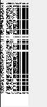

# PoC

This is a proof of concept to demonstrate several implications
of incorrect memory allocation for image handling in
the `pbm` and `xbm` format.

We found this issue to be present in Qt 5.15.2
and the latest QT6 available (6.2.1-2).
Most likely other versions are affected as well.


The first vulnerability is the heap out of bounds read, which allocates
the memory read from the `xbm` or `pbm` file header.
For this a crafted `.pbm` file is passed to the QImage object
and then rendered in an application.
After reading the real image data, the previously allocated QImage object
is processed without discarding unused memory.

A file with this header will allocate around 4GB (2^15+2^15 bytes) of memory:

```
P1
32786 32786
```

The next issue is that in certain applications this image file is rendered
and possibly exposed to third parties.
The information rendered in the image are the raw heap bits shown as a monochrome
image.

```
P1
40 150
```


