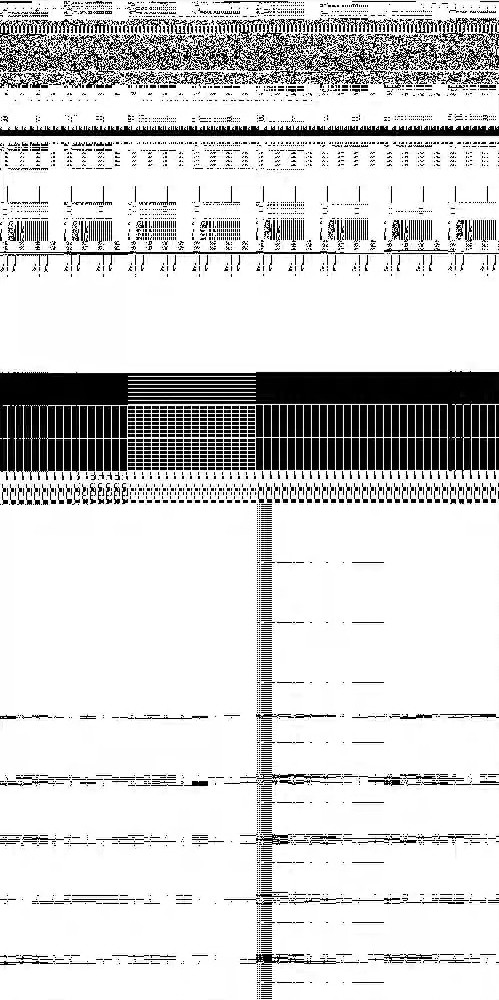

# PoC

This is a Proof of Concept to demonstrate several implications
of incorrect memory allocation for image handling in
the `pbm`, `ppm` and `xbm` format.

We found these issues to be present in Qt 5.15.2
and the latest QT6 available at the time of discovery (6.2.1-2).
Most likely other older versions are affected as well but we did not confirm this.

## Read of Uninitialized Memory

The vulnerability is a heap out of bounds read, which allocates
the memory boundaries defined in the *raw* or *ascii* `xbm`, `ppm` or `pbm` file header.
For this poc a crafted `.pbm` file is passed to the `QImage` object,
where the header indicates a larger pixel dimension than existing in
the file itself. The reader process does not stop at the end of the data
and continues to read from the uninitialized heap. This is then rendered in an application.
This can be abused as a Denial-of-Service or Information Leak.

Example: Create ephemeral Teamspeak channels with this image set in the description. Per channel around 4GB are allocated at every user on the server. 

A file with this header will allocate around 4GB ((2^15)*(2^15)-2 bytes) of memory:

```
P1
32767 32767
```

In certain applications this image file is rendered
and possibly exposed to third parties.
The information rendered in the image are the raw heap bits shown as a monochrome
image. These can be reversed into the binary data by using OCR and then secrets or other information leaks can be searched.



The issue seemed to be introduced in this [commit](https://github.com/qt/qtbase/commit/1a63409579ff0e9ce524c09701c1ef8bd2d99f25/src/gui/image/qppmhandler.cpp). Another related vulnerability, which was present at the time of investigation
was that even correct `pbm` (ascii mode) images were parsed and rendered incorrectly, leaking heap data.

The issues were fixed in this [commit](https://github.com/qt/qtbase/commit/997c052db9e2bef47cf8217c1537a99c2f086858) and this [commit](https://github.com/qt/qtbase/commit/8ce36938569841020daf9dc23e41438b06e0ee53) and no CVE or security release was assigned by the QT project, which is the reason we waited a long time for public disclosure.

The responsible QT maintainer took swift action to fix the underlying issue but it
seems like the coordination and process resulted in dropping the public
disclosure from the QT side.
Multiple other CVEs and security issues were publicly disclosed in QT-5/6 in the meantime. We carried on with our lives and multiple
patched releases happened, so we feel it is fine to publish this issue now.

Some applications seem not to have upgraded to the latest QT versions available,
so we hope this publication will lead to attention by the developers
using outdated QT versions.

The issue was easy to exploit and so intuitive that we had a lot of fun
figuring out how the heap layout was constructed. By filling small or
big size heap buckets on we could visually observe changes in the resulting images. We recommend others to use this in-the-wild issue
to give students or beginners without deep programming or exploitation
knowledge a visual insight into how heap is rendered and could be leaked.

Thanks @flipnut for the fun time :wave: